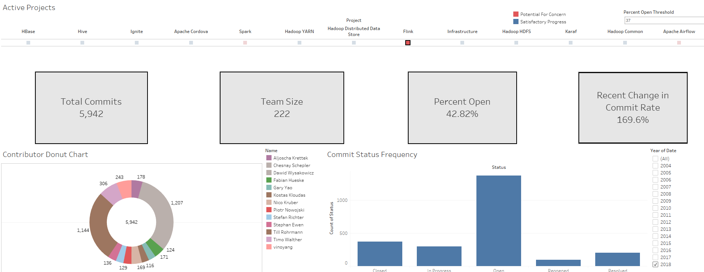
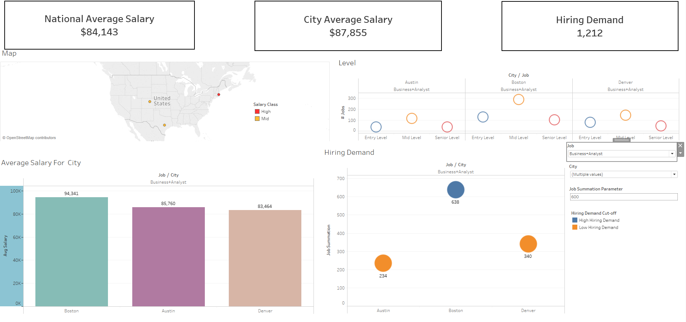

# Tableau-Dashboards-for-Project-Management

This project was to use Tableau to generate a pair of useful dashboards for Indeed, the job placement company.  

We elected to do one internal dashboard (for use by Indeed management) and one external dashboard (for use by customers).

Internal dashboard
=
The internal dashboard provides information about overall status and individual contributions for ongoing projects.

External dashboard
=
The external dashboard provides some context for job availability and salary in the U.S. based on job title and salary, as  
Indeed's website seems to be broadly lacking in visualizations.

